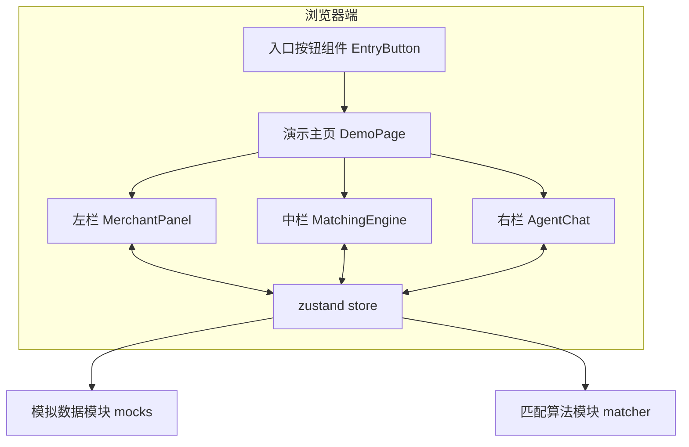

# Agent World 商业智能推广 Demo - 技术架构文档

## 1. 架构设计

本项目为纯前端演示 Demo，采用 React + Vite + Tailwind CSS v3 单页架构，状态管理使用 zustand，所有数据通过前端模拟，无后端依赖。



## 2. 技术说明

- **构建工具**：Vite 5
- **框架**：React 18 + TypeScript
- **样式**：Tailwind CSS v3（含自定义深色主题扩展）
- **状态管理**：zustand 4
- **图标**：lucide-react
- **动效**：Framer Motion（按需引入，仅用于复杂动画）
- **后端**：无（纯前端）
- **数据**：内置模拟数据（mock）+ 内存中的算法匹配逻辑
- **包管理**：npm（按 Vite 模板默认）

## 3. 路由定义
| 路由 | 用途 |
|------|------|
| `/` | 演示主页：默认进入，呈现三栏式 Demo 界面 |
| `/promo` | 商业智能推广 Demo 主页（与 `/` 等价，便于后续嵌入导航） |

> 说明：本 Demo 设计为「单页应用 + 入口按钮」形态，主页面挂载演示组件，无需复杂路由。

## 4. 组件结构

```
src/
├── App.tsx                      // 演示主页面，承载三栏布局
├── main.tsx                     // 应用入口
├── components/
│   ├── EntryButton.tsx          // 可嵌入导航栏的入口按钮
│   ├── TopBar.tsx               // 顶部状态条（步骤指示器）
│   ├── panels/
│   │   ├── MerchantPanel.tsx    // 左栏 B 端商家上传
│   │   ├── MatchingEngine.tsx   // 中栏算法匹配
│   │   └── AgentChat.tsx        // 右栏 Agent 推荐
│   ├── ui/
│   │   ├── CollapsiblePanel.tsx // 可折叠面板容器
│   │   ├── Tag.tsx              // 标签组件
│   │   ├── Button.tsx           // 统一按钮
│   │   └── ProgressBar.tsx      // 进度条
│   └── effects/
│       ├── ParticleField.tsx    // 数据流动效
│       └── TypewriterText.tsx   // 打字机文字
├── store/
│   └── usePromoStore.ts         // 全局状态：产品信息、画像、匹配进度、对话
├── data/
│   ├── products.ts              // 模拟产品数据
│   ├── personas.ts              // 模拟用户画像
│   └── recommendations.ts       // 模拟 Agent 推荐话术模板
├── lib/
│   └── matcher.ts               // 标签 ↔ 画像匹配算法
└── styles/
    └── index.css                // Tailwind 入口 + 自定义变量
```

## 5. 状态管理设计

使用 zustand 单一 store 管理演示状态：

```ts
interface PromoState {
  // B 端（不含画像选择）
  productType: 'software' | 'hardware';
  productName: string;
  productDesc: string;
  productPrice: number;
  productImage: string;

  // 中台 - 两阶段
  matchingStage: 'idle' | 'left' | 'inferring' | 'matching' | 'right' | 'done';
  inferredPersonas: string[];     // AI 推断出的目标画像
  matchProgress: number;          // 0-100
  matchedAgents: number;

  // C 端
  chatMessages: ChatMessage[];

  // UI
  collapsedPanels: { left: boolean; middle: boolean; right: boolean };

  // actions
  submitPromo: () => void;
  reset: () => void;
  togglePanel: (panel) => void;
}
```

## 6. 模拟数据

- **画像库**：内置 8 类用户画像（孤独/缺少陪伴、职场焦虑、健身爱好者、数码发烧友、母婴人群、学生、旅行者、创作者）
- **产品画像推断**：根据产品类型 + 描述关键词，规则化地推断出 2–4 个目标画像标签
- **推荐话术模板**：每类画像对应 2–3 套自然口吻推荐话术
- **匹配算法**：基于画像标签集合的 Jaccard 相似度 + 模拟 AI 评分（带随机扰动以呈现「真实算法」效果）

## 7. 入口按钮组件 API

```tsx
<EntryButton
  onClick={() => navigate('/promo')}  // 必填，点击回调
  label="商业智能推广"                  // 可选，默认 '商业智能推广'
  variant="primary" | "ghost"         // 可选，默认 'ghost'
  iconSize={18}                       // 可选
/>
```

入口按钮可独立导入嵌入已有 Agent World 应用的导航栏中，无需修改其他代码。

## 8. 性能与可维护性
- 单文件组件 < 300 行
- 演示用动画统一通过 `requestAnimationFrame` 或 CSS 动画实现，避免阻塞主线程
- 所有颜色、间距、字号通过 Tailwind 主题扩展统一管理，便于后续接入 Agent World 既有设计系统
